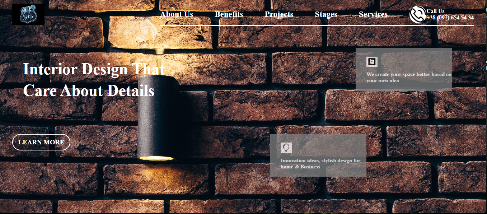

# By Akshun Verma

## Project Name: Interior Design Landing Page

## What I have learnt in this project ?
  - Classes
  - PseudoSelectors
  - Selectors
  - CSS Positioning
  - Know about pexels website too

# Time taken to complete
- 5 hours

# Here is the live link of this project
- [Live Link](https://project10-ineuron-45.netlify.app/)

